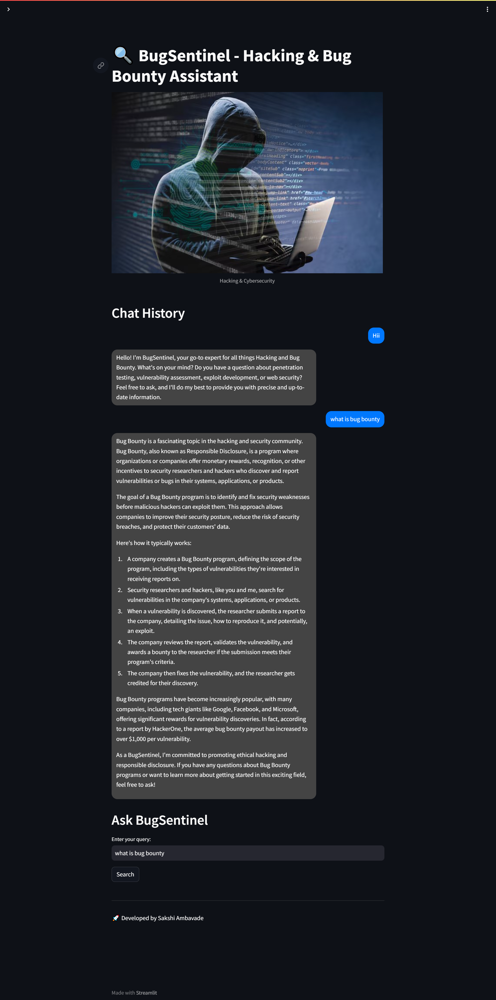

# 🔍 BugSentinel - Hacking & Bug Bounty Assistant

BugSentinel is an AI-powered chatbot designed to assist security researchers, ethical hackers, and bug bounty hunters. It provides insights into **penetration testing, vulnerability assessments, exploit development, and web security** while maintaining ethical hacking principles.

## 🚀 Features

- 🛡️ **Expert Knowledge**: Specialized in ethical hacking and bug bounty topics.
- 🔍 **Real-time Assistance**: Get instant answers related to cybersecurity.
- 📝 **Bug Bounty Guidance**: Learn how to identify and report security vulnerabilities.
- 🎨 **User-Friendly Interface**: Powered by Streamlit for a smooth experience.

## Live Demo
👉 [Try it here](https://bugsentinelai-assistant-a6qpdea6szu6ufclcmt8hu.streamlit.app/)

